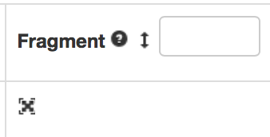

# How to find the fragment of a request in McM

GEN fragment is available ONLY for root requests, namely for requests at the beginning of a chain. To access the chain of a specific request, one must click the button below in the page of a request.

.png>)

This will open the page if the chained request which looks like that:

.png>)

In this case the root request is  [PPD-PhaseIIMTDTDRAutumn18GS-00032](https://cms-pdmv.cern.ch/mcm/requests?prepid=PPD-PhaseIIMTDTDRAutumn18GS-00032\&page=0). If one click there, one should go to "Select View" (see below) and tick "Fragment".

.png>)

The panel below will appear and by clicking the cross button, one has access to the generator fragment, which contains information about the gridpack, the tune and the matching parameters (when applicable).

